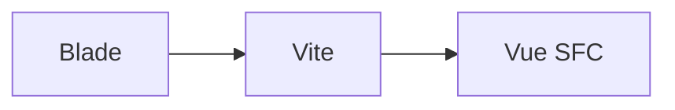

[← Предыдущий гайд](clean-problems-formatting.md) · [К README](../README.md)

# Productivity Power-Ups: расширения-2026, фичи редактора, горячие клавиши

> Апгрейд воркспейса «всё, что ускоряет и упрощает». Дата: 2026-09-20.
> Все кандидаты верифицированы через API реестра Open VSX (лицензия, дата
> релиза, загрузки, deprecated) — Code OSS-совместимость гарантирована,
> freemium/AI-облако отсеяны. Исходная таблица вердиктов — в
> `.ai-factory/plans/vscode-productivity-powerups.md`.

## Новые расширения (в рекомендациях)

| ID | Лицензия | Релиз | Что даёт |
|---|---|---|---|
| humao.rest-client | MIT | стабилен | Тесты API в `.http`-файлах — вместо Postman |
| vitest.explorer | MIT | 2026-09 | Гуттер-раннер Vitest (Vue/JS), панель Testing |
| christian-kohler.npm-intellisense | MIT | стабилен | Автокомплит npm-модулей в import |
| mikestead.dotenv | MIT | стабилен | Подсветка `.env` |
| mhutchie.git-graph | MIT | стабилен | Визуализация веток/коммитов — GitLens-free |
| alefragnani.Bookmarks | GPL-3.0 | 2026-04 | Метки-строки и прыжки; v14 «Fully Open Source again» |
| mechatroner.rainbow-csv | MIT | 2026-03 | Подсветка колонок CSV/TSV + RBQL-запросы |
| timonwong.shellcheck | MIT | 2026-09 | Линтинг bash-скриптов |
| DavidAnson.vscode-markdownlint | MIT | 2026-08 | Качество markdown-доков |
| bierner.markdown-mermaid | MIT | 2026-05 | Mermaid-диаграммы в markdown-preview |

Опционально (в JSONC-комментарии extensions.json): ms-vscode.live-server
(замена заброшенного ritwickdey.liveserver), donjayamanne.githistory,
yzhang.markdown-all-in-one.

## REST Client — API-тесты в редакторе

Создайте `routes.http` в проекте:

```http
@baseurl = http://localhost:8000
@token = {{login.response.body.token}}

# @name login
POST {{baseurl}}/api/login
Content-Type: application/json

{"email": "test@example.com", "password": "secret"}

###

GET {{baseurl}}/api/user
Authorization: Bearer {{token}}
```

Клик «Send Request» над запросом — ответ в соседней вкладке. `###` разделяет
запросы, `@имя` — переменные, `# @name` — именованный запрос для цепочек.

## Vitest explorer

Требует vitest в проекте: `npm i -D vitest`. Тесты запускаются из гуттера
и панели Testing; конфиг берётся из `vitest.config.ts` проекта.

## ShellCheck — установка бинаря (одна на машину)

```bash
sudo pacman -S --needed shellcheck
```

Без бинаря расширение молчит — diagnostics появятся после установки.

## Задачи воркспейса (Terminal → Run Task)

- **Интелли-чек воркспейса** — `npm test` в tools/intellisense-check (дефолтная
  test-задача: Ctrl+Shift+; → Tasks: Run Test Task)
- **Rust doctor** — PASS/FAIL-диагностика тулчейна
- **Валидация JSONC-конфигов** — `tools/validate-jsonc.php` по settings /
  extensions / tasks / keybindings

npm-скрипты вложенных проектов подхватываются автодетектом отдельно.

## Горячие клавиши phpantom (.vscode/keybindings.json)

| Клавиши | Команда | Что делает |
|---|---|---|
| Alt+R | phpantom.showRouteList | Список роутов Laravel с фильтром |
| Alt+A | phpantom.runArtisanCommand | Раннер artisan-команд |
| Alt+M | phpantom.generateModelAnnotations | `@property`-аннотации Eloquent из живой БД |
| Alt+L | phpantom.showLogViewer | Хвост `storage/logs/*.log` с подсветкой |

## Микро-скорость (settings.json)

`explorer.confirmDelete/confirmDragAndDrop: false` — без подтверждений;
`diffEditor.ignoreTrimWhitespace: false` — честные git-диффы.

## Новые live templates

- php: `invk` — single-action контроллер `__invoke()`; `mig12` — миграция
  анонимным классом (Laravel 11/12). Уже были: `enum`/`enumb`, `scope:`, `col:`.
- vue: `useTplRef` — `useTemplateRef('name')` (Vue 3.5); `useid` — `useId()`
  (Vue 3.5, SSR-безопасные id).
- rust: без изменений — семейство `bsys`/`bsysq`/`bres`/`bevent`/`bplugin`/
  `bapp`/`bcomp` уже покрывает Bevy.

## Mermaid в доках

`bierner.markdown-mermaid` рендерит блоки в preview (Ctrl+Shift+V):



## Регресс-чеки

1. `cd tools/intellisense-check && npm test`
2. `php tools/validate-jsonc.php .vscode/*.json` (задача «Валидация JSONC»)
3. Чек-лист: Command Palette видит phpantom-команды; Run Task — 3 задачи;
   Alt+R/A/M/L не перехвачены другими расширениями (Keyboard Shortcuts UI);
   Problems по-прежнему чист.

---

## См. также

- [Live Templates и CSS](live-templates-and-css.md) — все live templates воркспейса
- [Чистые Problems](clean-problems-formatting.md) — политика «анализ — только свой код»
