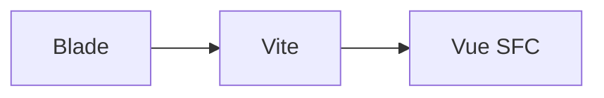

[← Предыдущий гайд](clean-problems-formatting.md) · [К README](../README.md) · [Следующий гайд →](js-standalone-root.md)

# Productivity Power-Ups: расширения-2026, фичи редактора, горячие клавиши

> Апгрейд воркспейса «всё, что ускоряет и упрощает». Дата: 2026-09-20.
> Все кандидаты верифицированы через API реестра Open VSX (лицензия, дата
> релиза, загрузки, deprecated) — Code OSS-совместимость гарантирована,
> freemium/AI-облако отсеяны. Исходная таблица вердиктов — в
> `.ai-factory/plans/vscode-productivity-powerups.md`.

## Новые расширения (в рекомендациях)

| ID | Лицензия | Релиз | Что даёт |
|---|---|---|---|
| humao.rest-client | MIT | стабилен | Тесты API в `.http`-файлах — вместо Postman |
| vitest.explorer | MIT | 2026-09 | Гуттер-раннер Vitest (Vue/JS), панель Testing |
| christian-kohler.npm-intellisense | MIT | стабилен | Автокомплит npm-модулей в import |
| mikestead.dotenv | MIT | стабилен | Подсветка `.env` |
| mhutchie.git-graph | MIT | стабилен | Визуализация веток/коммитов — GitLens-free |
| alefragnani.Bookmarks | GPL-3.0 | 2026-04 | Метки-строки и прыжки; v14 «Fully Open Source again» |
| mechatroner.rainbow-csv | MIT | 2026-03 | Подсветка колонок CSV/TSV + RBQL-запросы |
| timonwong.shellcheck | MIT | 2026-09 | Линтинг bash-скриптов |
| DavidAnson.vscode-markdownlint | MIT | 2026-08 | Качество markdown-доков |
| bierner.markdown-mermaid | MIT | 2026-05 | Mermaid-диаграммы в markdown-preview |

Опционально (в JSONC-комментарии extensions.json): ms-vscode.live-server
(замена заброшенного ritwickdey.liveserver), donjayamanne.githistory,
yzhang.markdown-all-in-one.

## REST Client — API-тесты в редакторе

Создайте `routes.http` в проекте:

```http
@baseurl = http://localhost:8000
@token = {{login.response.body.token}}

# @name login
POST {{baseurl}}/api/login
Content-Type: application/json

{"email": "test@example.com", "password": "secret"}

###

GET {{baseurl}}/api/user
Authorization: Bearer {{token}}
```

Клик «Send Request» над запросом — ответ в соседней вкладке. `###` разделяет
запросы, `@имя` — переменные, `# @name` — именованный запрос для цепочек.

## Vitest explorer

Требует vitest в проекте: `npm i -D vitest`. Тесты запускаются из гуттера
и панели Testing; конфиг берётся из `vitest.config.ts` проекта.

## ShellCheck — установка бинаря (одна на машину)

```bash
sudo pacman -S --needed shellcheck
```

Без бинаря расширение молчит — diagnostics появятся после установки.

## Задачи воркспейса (Terminal → Run Task)

- **Интелли-чек воркспейса** — `npm test` в tools/intellisense-check (дефолтная
  test-задача: Ctrl+Shift+; → Tasks: Run Test Task)
- **Rust doctor** — PASS/FAIL-диагностика тулчейна
- **Workspace doctor** — PASS/FAIL-диагностика веб-стека: phpantom + path-ignore,
  xdebug, машинный php-cs-fixer + wrapper, ключевые расширения, свежесть снимка
  user settings (`tools/workspace-doctor.sh`)
- **Интелли-чек: PHPantom** — `npm run test:phpantom` в tools/intellisense-check:
  PHPantom в чистом инстансе VS Code на WP-инсталле (env `WP_ROOT` + `WP_THEME`;
  полигон — Sage-тема с editor-стабами, см. docs/phpantom-wordpress.md)
- **Диагностика WP-инсталла (intellisense-check)** — `npm run diag:wp`; корень
  темы/инсталла вводится через promptString (input `wpThemeRoot`)
- **Валидация JSONC-конфигов** — `tools/validate-jsonc.php` по 14 файлам:
  settings / extensions / tasks / keybindings / launch + opencode.json +
  все 8 `*.code-snippets` (битая запятая в сниппетах ловится до того, как
  молча отключит шаблоны языка)

npm-скрипты вложенных проектов подхватываются автодетектом отдельно.

## Фишки редактора (2026-09-23)

Действуют глобально (машинные user settings → любой открытый корень) и в
воркспейсе `_vscode`:

| Фишка | Ключ | Что даёт |
|---|---|---|
| Read-only чужой код | `files.readonlyInclude` | vendor / ядра WP/Bitrix / target / dist нельзя случайно отредактировать — чтение и F12 работают; снять — палитра: «Files: Toggle Active File Read Only in Session». Философия та же, что path-ignore phpantom и search.exclude |
| File nesting | `explorer.fileNesting.*` | lock-файлы и rc-конфиги сворачиваются под package.json / Cargo.toml / composer.json — проводник без мусора |
| Автообновление import | `typescript.updateImportsOnFileMove.enabled` + `javascript…` | перенос/переименование файла чинит import-пути само (`"always"`; `"prompt"` — если нужен контроль) |
| Переиспользование табов | `workbench.editor.revealIfOpen` | F12/Ctrl+Click переоткрывают уже открытый редактор, а не плодят дубли («Smart open» vue-css-jump) |

Скрипты автоматизации (tools/):

- `install-extensions.sh` — CLI-установка всех рекомендаций
  `.vscode/extensions.json` (`--force` — обновить до свежих VSIX). Новая
  машина: один запуск вместо UI «Install All».
- `machine/install.sh` — машинный php-cs-fixer-уровень одной командой
  (идемпотентен); `machine/export-user-settings.sh` — обновить снимок user
  settings из живого файла (анти-дрейф, прогоняет workspace-doctor как чек).

## Встроенные возможности Code OSS 2025–2026 (2026-09-29)

Без расширений — требует редактор 1.10x+ (проверка: `code-oss --version`).
Ключи прописаны в машинных user settings → действуют в любом открытом окне:

| Возможность | Ключ | Версия | Что даёт |
|---|---|---|---|
| Git blame в строке | `git.blame.editorDecoration.enabled: true` | 1.97 | Автор+коммит в конце строки (hover — детали). Free-замена функции GitLens; статус-бар item — on по умолчанию (`git.blame.statusBarItem.enabled`) |
| Авто-fetch | `git.autofetch: true` | — | `git fetch` фоном — статус веток всегда свежий |
| Git worktrees | — (UI из коробки) | 1.103 | Несколько веток одновременно: Command Palette → «Git: Create New Worktree…» — без CLI и расширений |
| Terminal IntelliSense | `terminal.integrated.suggest.enabled: true` | 1.106 (GA) | Completions путей/флагов/истории команд в bash |
| Брейкпоинты деревом | `debug.breakpointsView.presentation: "tree"` | 1.108 | Группировка брейкпоинтов по файлам — порядок при Xdebug/CodeLLDB-сессиях с десятками точек |
| Staged-изменения в гуттере | — (default) | 1.100 | Индикаторы staged-правок в редакторе, без Source Control-панели |
| EditContext-ввод | — (default) | 1.101 | Стабильный ввод/IME — ничего настраивать не нужно |

Из той же волны — глобально выровнены с воркспейсом (аудит 29.09.2026):
`[json]/[jsonc]/[yaml]` получили явный форматтер Prettier (нет диалога
«Multiple Formatters»), `[vue]` — Prettier вместо Volar (Volar не читает
`prettier.useTabs` → чужие окна форматировали SFC пробелами), телеметрия
off на машинном уровне, мёртвые ключи (phpResolver, kilo-code) удалены,
`editor.tabCompletion: "onlySnippets"` и sticky scroll — едины везде.

## Горячие клавиши phpantom (.vscode/keybindings.json)

| Клавиши | Команда | Что делает |
|---|---|---|
| Alt+R | phpantom.showRouteList | Список роутов Laravel с фильтром |
| Alt+A | phpantom.runArtisanCommand | Раннер artisan-команд |
| Alt+M | phpantom.generateModelAnnotations | `@property`-аннотации Eloquent из живой БД |
| Alt+L | phpantom.showLogViewer | Хвост `storage/logs/*.log` с подсветкой |

## Микро-скорость (settings.json)

`explorer.confirmDelete/confirmDragAndDrop: false` — без подтверждений;
`diffEditor.ignoreTrimWhitespace: false` — честные git-диффы;
`extensions.autoUpdate: "onlyEnabledExtensions"` — не обновлять неиспользуемые
расширения в фоне; `editor.minimap.enabled: false` — миникарта не рендерится
(реверсивно: `true` вернёт); `terminal.integrated.commandsToSkipShell` —
Alt+R/A/M/L работают и при фокусе в терминале (phpantom-команды перехватывает
Code, а не shell; дефолтный список сохраняется).

## Новые live templates

- php: `invk` — single-action контроллер `__invoke()`; `mig12` — миграция
  анонимным классом (Laravel 11/12); `freq` — класс FormRequest
  (authorize/rules/prepareForValidation). Уже были: `enum`/`enumb`, `scope:`, `col:`.
- vue: `useTplRef` — `useTemplateRef('name')` (Vue 3.5); `useid` — `useId()`
  (Vue 3.5, SSR-безопасные id); `dmod` — `defineModel<T>()` (Vue 3.4+,
  two-way binding без props+emit); `vprov`/`vinj` — provide/inject;
  `vsfcm` — каркас SFC с внешним `*.module.css` (подсказки `$style`).
- rust: без изменений — семейство `bsys`/`bsysq`/`bres`/`bevent`/`bplugin`/
  `bapp`/`bcomp` уже покрывает Bevy.

## Mermaid в доках

`bierner.markdown-mermaid` рендерит блоки в preview (Ctrl+Shift+V):


```mermaid
graph LR
	A[Blade] --> B[Vite]
	B --> C[Vue SFC]
```

## Регресс-чеки

1. `cd tools/intellisense-check && npm test`
2. `php tools/validate-jsonc.php .vscode/*.json` (задача «Валидация JSONC»)
3. Чек-лист: Command Palette видит phpantom-команды; Run Task — 6 задач;
   Alt+R/A/M/L не перехвачены другими расширениями (Keyboard Shortcuts UI);
   Problems по-прежнему чист.

## Исследование готовых настроек 2026-10 (интернет-аудит)

> Цикл «поизучай в интернете → возьми в тест → проверь» (план
> `.ai-factory/plans/code-oss-settings-research-test.md`): dotfiles-гайды
> 2025–2026, awesome-списки, релиз-ноты VS Code 1.140, верификация кандидатов
> через API Open VSX (`curl https://open-vsx.org/api/<ns>/<name>`).

### Настройки — применённые (машинный уровень, зеркально в снимок tools/machine)

| Ключ | Значение | Зачем |
|---|---|---|
| `editor.occurrencesHighlight` | `"singleFile"` | перф: дефолт `multiFile` ищет вхождения фоном по ВСЕМ файлам — лишняя работа на WP/Bitrix-корнях; философия «только свой код» |
| `editor.suggestSelection` | `"recentlyUsedByPrefix"` | ранжирование подсказок «недавно использованные по префиксу» |
| `editor.guides.bracketPairsHorizontal` | `"active"` | горизонтальные направляющие многострочных конструкций (дополняют вертикальные) |
| `workbench.tree.indent` | `20` | читаемость глубокой вложенности (Bitrix local/, resources/views); дефолт 8 |
| `terminal.integrated.scrollback` | `10000` | дефолта 1000 мало для логов artisan serve / vite / cargo run |

Отклонённые (с причинами): `files.hotExit` — `autoSave: afterDelay` уже
сохраняет всё; `editor.formatOnSaveMode: "modifications"` — конфликт с
политикой полного детерминированного форматирования (php-cs-fixer/Prettier
whole-file); `extensions.ignoreRecommendations` — гасит полезные динамические
tips (решено ранее); «лимит reopen-closed-editors» — ключа в схеме нет.
Отложено до обновления Code OSS до 1.140: `editor.selectedTextMatchMode`,
`git.worktreeSymlinkFolders` (эксперимент; переиспользование node_modules
между worktree). Анти-дрейф-фикс: `extensions.autoUpdate` в живом user
settings вернулся к `"on"` — приведён к снимку (`"onlyEnabledExtensions"`).

### Расширения — вердикты (API Open VSX, 02.10.2026)

| Расширение | Open VSX | Вердикт |
|---|---|---|
| streetsidesoftware.code-spell-checker | 4.9.5 (26.09.2026), GPL-3.0, активно | **optional**: орфография EN в коде; для ru-текстов — словарь code-spell-checker-russian (2.2.4, MIT) + cSpell languageSettings, иначе рус. комментарии = шум |
| emilast.LogFileHighlighter | 2.8.0; последний релиз **2020-06** | **отклонён**: стагнация 6 лет; логи уже покрыты phpantom log-viewer (Alt+L) |
| wix.vscode-import-cost | 3.3.0 (2022), MIT | подтверждён как optional |
| «Highlight Bad Chars» | в реестре не найден | отклонён |

Внекатегорные машинные (sftp, inifmt, nginx-beautifier, vscode-xml,
cherry-markdown, pinit): решение — осознанный машинный опционал под рабочие
сценарии, в recommendations не вносить (закрыт вопрос T7 из
code-oss-global-setup-audit).

### Регрессии версий (диагностика 02.10.2026, intellisense-check)

1. **Зомби-окна после системного обновления (главный урок 02.10.2026).**
   `sudo pacman -Syu`, тронувший `electron42/43` (или `code`) под работающими
   окнами Code OSS, оставляет их бегать с удалённого inode: любой спавн
   дочернего процесса падает `spawn /usr/lib/electron42/electron (deleted)
   ENOENT`. Симптомы: JSON Language Server крашится 5 раз и замолкает,
   у Volar умирает tsserver → пропсы/подсказки Vue пропадают (vue-css-jump
   hover-карточки при этом живы — работает без tsserver-цепочки). Диагностика:
   `ls -l /proc/<pid>/exe` → `(deleted)`. **Фикс: полный перезапуск Code OSS
   (File → Exit во всех окнах; Reload Window НЕ помогает — главный процесс
   остаётся). Правило гигиены: после всякого pacman -Syu с electron/code —
   полный перезапуск редактора.**
2. **css-modules-kit 1.4.0 × VS Code 1.140** (кейс 6a): классы из
   `*.module.css` пропадают из member-list импорта в `.ts` (CSS custom
   properties остаются). Узкий путь (не влияет на пропсы/шаблоны/$style);
   отслеживать upstream (mizdra/css-modules-kit).
3. **Test-host 1.138 не воспроизводит template-цепочку Volar** (кейсы 4/5b
   красные на ЛЮБОЙ версии Volar 3.2.9–3.3.11 при живом редакторе; 1.140
   частично воспроизводит). Известное ограничение test-electron (см. WARN
   кейса 6: .vue → Inferred-проект). Вывод: падение кейсов 4/5b на инстансе
   1.138 — НЕ регрессия Volar и не повод даунгрейдить расширения/редактор.

### Верификация (02.10.2026)

- `npm test` (инстанс 1.140): 23 passing / 1 failing — только кейс 6a (см. выше)
- `npm run test:rust`: 3 passing (R1–R4c) · `npm run test:wgsl`: 2 passing (W1–W2)
- `php tools/validate-jsonc.php .vscode/extensions.json`: OK
- Code OSS на машине: 1.138.0 (пакет `code`) — обновление до 1.140 за
  пользователем; там же десятки memory-leak фиксов 1.140 (terminal/semantic
  tokens/extension host — актуально для docs/rust-memory.md)
- Замер RSS rust-analyzer в момент аудита невозможен (сервер не был запущен);
  метод — `tools/rust-memory-report.sh`; эксперимент
  `extensions.experimental.affinity` отложен (нет измеримой базы)

---

## См. также

- [Live Templates и CSS](live-templates-and-css.md) — все live templates воркспейса
- [Чистые Problems](clean-problems-formatting.md) — политика «анализ — только свой код»
